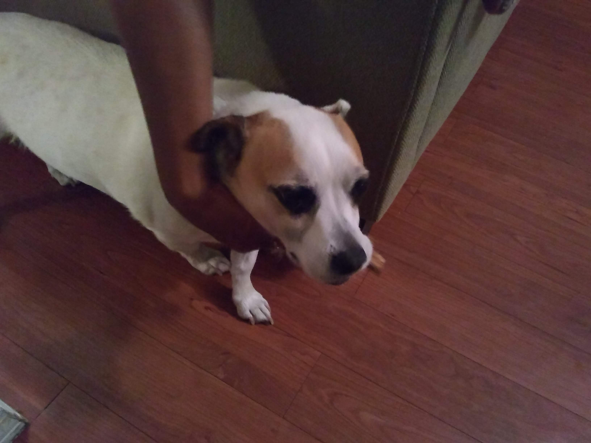

# John
Hello! My name is John,
I am from New Orleans, Louisiana. I moved here in 2005, and have lived here since then.
In this class, I am hoping to become more fluent in the C++ programming language. I currently know (but am __still__ learning) the following languages:
* Assembly
* Batch
* C
* C#
* **Python**
  * I am currently working on making a video game in this language, to improve my general programming logic skill. :space_invader: :video_game:
* VHDL
  * I am not currently programming in this language, but I enjoyed programming in it when I did.
I have two pets, but unfortunately I only have a photo of one. His name is Scout, and he is a Jack Russel Terrier mix:

After graduating from the University of New Mexico, I might find a job here for a short time, then take some time to travel the world. Other than that, we'll see what's next! :earth_americas: :airplane:
